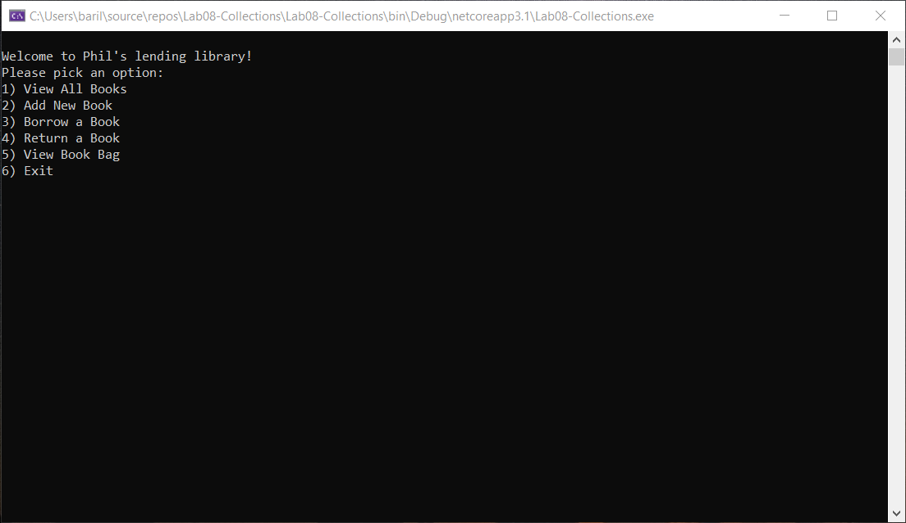
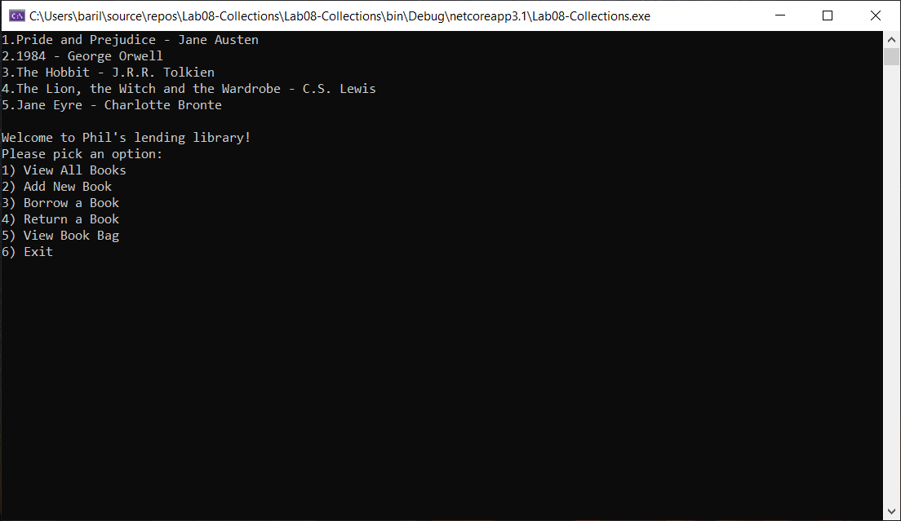
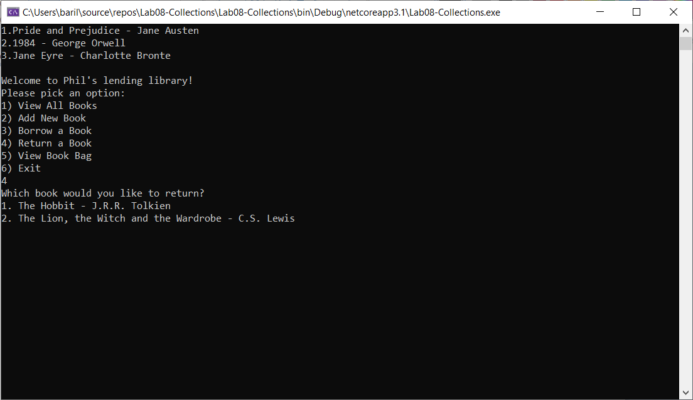

# Console Application - Collections

## Phil’s Lending Library

Lab08-Collections

*Author: Na'ama Bar-Ilan*

----

## Description

This is a C# console application that allows users to borrow and return books from a library. The lending library is a generic collection, and Book is a separate class that holds all the relevant properties and behaviors. 

Through a user interface, users are able to add and remove items from the newly created library and place them into another generic collection, to prove the movement of the individual objects.


---

### Getting Started
Clone this repository to your local machine.

```
$ git clone [https://github.com/NaamaBarIlan/Lab08-Collections.git]
```

### To run the program from Visual Studio:
Select ```File``` -> ```Open``` -> ```Project/Solution```

Next navigate to the location you cloned the Repository.

Double click on the ```Lab08-Collections``` directory.

Then select and open ```Lab08-Collections```

---

### Visuals

#### Application Start

#### Using the Application

#### Application End


---

### Change Log

1.2: *Fixed Add New Book option of the UserInterface method, added 5 unit tests and summary comments to all methods* - 19 Jul 2020
1.1: *Credit - I used Amanda Iverson's solution to help me understand the problem domain for this initial version of the application* - 15 Jul 2020.


------------------------------
